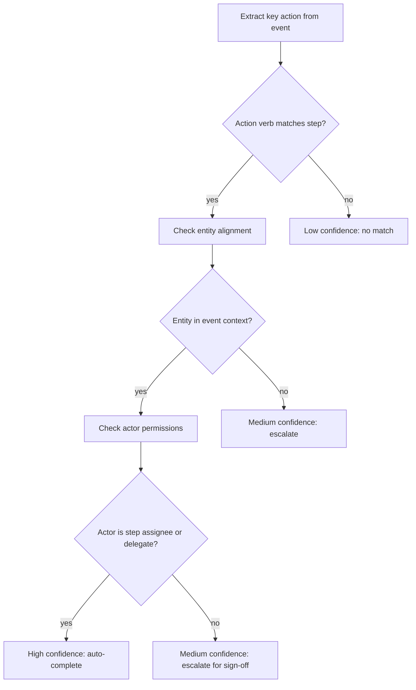

# BRAID for Holonic SOP: Why We're Building on BRAID

**From:** OASIS / NextGen Software  
**To:** OpenSERV Labs  
**Date:** March 2026  
**Subject:** BRAID integration into the Holonic SOP System — context, rationale, and what we need

---

## What We've Built

We've built a **Holonic SOP System** on top of the STAR API — a platform that turns static Standard Operating Procedures into living, executable, auditable processes, managed as holons on the OASIS COSMIC hierarchy.

The core product has three layers:

1. **SOP App** — A web interface for creating, running, and monitoring SOPs. Teams define their procedures once. The system enforces, tracks, and learns from them.

2. **`star-watch`** — A background CLI daemon that connects to a company's existing tools (Slack, Salesforce, more coming) and passively observes what's happening. When it detects an action that matches an SOP step — "sent the welcome email," "opportunity moved to Proposal" — it auto-completes that step in the SOP runner and writes an immutable proof holon to STARNET.

3. **STAR API** — Provides workflow definitions, run management, avatar identity, and holonic storage. The proof holons written by `star-watch` are permanently verifiable records on-chain.

The product is working end-to-end in demo:
- Slack messages are detected in real time via Socket Mode
- Salesforce opportunity stage changes are detected via REST polling
- Matched SOP steps are auto-completed or escalated via Slack interactive messages
- Sign-offs write `SOPStepCompletionHolon` records to STARNET
- The SOP app displays a live activity feed of all events and matches

---

## Where BRAID Fits

The critical function in `star-watch` is the **matcher**: given an observed event from the real world, determine whether it completes an SOP step.

```
Event:    { source: "slack", actor: "alex@company.com",
            message: "just sent the contract over to the client" }

SOP Step: { name: "Send client contract",
            description: "Send signed contract document to client contact",
            requiresSignOff: true }

Question: Does this event = this step being completed?
          And with what confidence?
```

Right now, we have a keyword-based fallback doing this work. It functions — and it demonstrated the proof of concept — but it is not good enough for production or compliance use cases.

We need a matching engine that is:

- **Semantically accurate** — understands intent, not just keywords
- **Consistent** — same event + same step = same answer, every time
- **Explainable** — produces an auditable reasoning trace, not just a score
- **Cost-efficient at scale** — called thousands of times per day across many customers
- **Improvable over time** — gets better as more SOP runs accumulate

This is precisely where BRAID comes in.

---

## Why BRAID and Not Just GPT-4 / Claude

This is a fair question. We looked at it carefully.

### What a standard LLM approach looks like

You send a prompt to GPT-4o or Claude:

> *"Given this Slack message: 'sent the contract over to the client'. Does it complete the SOP step 'Send client contract'? Return a confidence score 0–1 and brief reasoning."*

This works. It gives a reasonable answer. But it has four serious problems for this use case:

**1. Inconsistency.** Probabilistic token sampling means the same input can produce different outputs on different runs. For a compliance product — where the output is used as evidence in an audit — "the AI said so, sometimes" is not acceptable. Courts, regulators, and enterprise legal teams require deterministic, reproducible reasoning.

**2. Cost.** At $0.007 per call (GPT-4o), 10,000 events per day across 100 customers = $7,000/day = $2.5M/year in inference costs before we've built anything else. That number is prohibitive.

**3. Opacity.** A standard LLM returns a confidence score and a narrative explanation. It cannot show the *reasoning path* it took. With BRAID, the Mermaid graph is the reasoning path — each node is an explicit decision the system made. That is what auditors need.

**4. No improvement.** Every call to GPT-4o is independent. There is no mechanism by which the 10,000th match is more accurate than the first, or cheaper, or more consistent. The system does not learn.

### What BRAID does differently

BRAID separates reasoning **generation** from reasoning **execution** (from arXiv:2512.15959, Amçalar & Cinar):

**Stage 1 — Generator (runs once per task type, high-tier model):**  
Produces a Mermaid reasoning graph encoding the logical topology for a class of decision.

**Stage 2 — Solver (runs per event, low-tier model):**  
Follows the graph deterministically. Not free-form reasoning — directed traversal of a pre-built decision structure.

For SOP step matching, the reasoning graph might look like:



This graph is generated **once** for the "action completion" task type. Every subsequent event is matched by running the cheap solver against this graph — not by calling a frontier LLM.

The paper reports:
- **30× efficiency gain** on procedural tasks (SOP matching is exactly a procedural task)
- **Up to 74× PPD** (performance per dollar) vs GPT-5 baseline on selected configurations
- **Same accuracy with small models** — the graph structure compensates for model capacity, meaning a cheap solver achieves frontier-level accuracy on bounded tasks

### The numbers for our use case

Using illustrative costs from the litepaper:

| Approach | Cost per match | 10k events/day | Annual (100 customers) |
|----------|---------------|----------------|------------------------|
| GPT-4o standard | $0.007 | $70/day | $2.5M |
| GPT-4o mini | $0.0015 | $15/day | $547k |
| BRAID (solver only, graph cached) | ~$0.0001 | $1/day | $36.5k |
| Holonic BRAID (shared graph library) | ~$0.00005 | $0.50/day | $18k |

The cost case is significant. But the *consistency and explainability* case is the one that matters most for enterprise adoption.

---

## The Holonic BRAID Extension

There is a further advantage specific to our architecture that we want to discuss with you.

Raw BRAID at scale has a cost problem: every new task type requires generating a new reasoning graph. If each customer deployment generates its own graphs, the generation cost multiplies with the number of customers, and PPD collapses (the litepaper calculates this precisely: PPD drops to ~1.5× baseline at scale without sharing).

**Holonic BRAID** solves this by storing BRAID reasoning graphs as holons in a shared library:

```
Cost_BRAID_no_sharing  ≈  T × (C_gen + C_solve)      [collapses with scale]
Cost_Holonic_BRAID     =  Q × C_gen + T × C_solve    [Q = task types, Q ≪ T]
```

For SOP matching, Q is small — maybe 30–50 distinct reasoning categories (action completion, document signing, stage transition, approval, escalation, etc.). T is large — millions of events per year across all customers.

The graph for "email confirmation step completion" is generated once, stored as a holon, replicated across MongoDB / Solana / IPFS (OASIS multi-provider architecture), and reused by every agent across every customer deployment. The cost per match approaches zero. Accuracy improves over time as usage data promotes high-accuracy graphs and deprecates low-performing ones.

This creates a genuine platform network effect: **the more customers run SOPs through STAR, the better and cheaper the matching gets for everyone.**

---

## What We Need From OpenSERV

We have implemented the `POST /api/braid/match` endpoint in the STAR API (`BraidController.cs`). It currently falls back to keyword matching when BRAID is unavailable, and will forward to the real BRAID service when `BRAID:BaseUrl` is configured.

The interface we expect:

```http
POST {BRAID_BASE_URL}/v1/match
Content-Type: application/json

{
  "event": {
    "source": "slack",
    "action": "message_sent",
    "actor": "alex@company.com",
    "entity": "sent the contract over to the client",
    "context": "channel: #deal-flow, timestamp: 2026-03-26T14:32:00Z"
  },
  "step": {
    "name": "Send client contract",
    "description": "Send signed contract document to client contact",
    "triggerConditions": ["contract sent", "document delivered", "signed agreement"],
    "requiresSignOff": true,
    "assignedTo": "alex@company.com"
  }
}

→ { "matched": true, "confidence": 0.91, "matchAction": "escalate", "reasoning": "..." }
```

Specifically:

1. **API access** — A `BRAID:BaseUrl` we can point our STAR API instance at for the `/v1/match` endpoint.
2. **Graph generation** — Whether we call the graph generation ourselves (Stage 1), or whether the BRAID API handles both stages internally.
3. **Holonic graph sharing** — Guidance on how to participate in the shared graph library. Are graphs stored as holons? Is there an existing graph library for procedural task matching? Can we contribute graphs back?
4. **Feedback loop** — A mechanism to report match outcomes (correct / incorrect) so the graph library can improve over time.
5. **Rate limits and pricing** — What the usage model looks like for an integration at this scale.

---

## The Bigger Picture

The Holonic SOP System is one of the first production applications of BRAID for enterprise process compliance. The matching problem we're solving — *did this real-world action complete this defined process step, with verifiable confidence?* — is precisely the kind of bounded procedural reasoning BRAID was designed for.

If it works as the paper describes, this becomes the foundation for something larger: every SOP step completion becomes an auditable, on-chain proof. Every company running on STAR contributes to a shared reasoning library that makes the whole system smarter. BRAID is the intelligence layer; OASIS is the identity and audit layer; STARNET is the trust layer.

We'd like to get API access as soon as possible so we can replace the keyword fallback with real BRAID matching and demonstrate the full system to enterprise prospects.

Looking forward to the conversation.

---

**OASIS / NextGen Software**  
*March 2026*

---

*For technical questions about the STAR API integration, `star-watch` architecture, or the SOP runner:  
see `/SOP/HOLONIC_SOP_SYSTEM_DOCUMENTATION.md` and `/SOP/STAR_WATCH_TECHNICAL_DESIGN.md` in the OASIS repo.*
