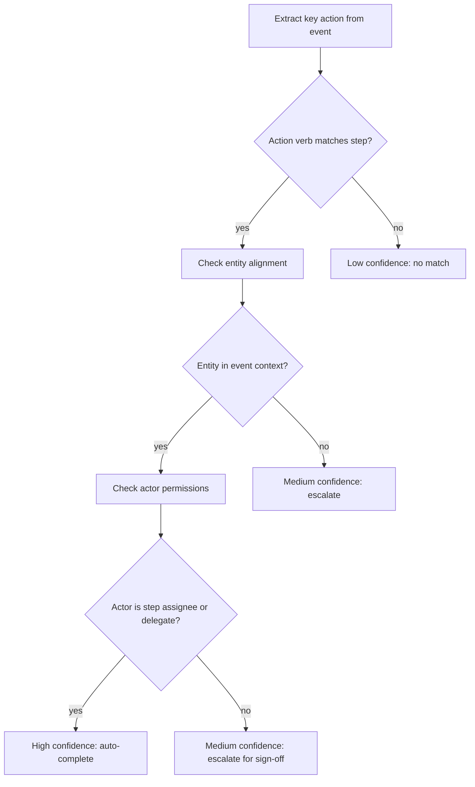

# OASIS × OpenSERV: BRAID for Holonic SOPs
## A Partnership Brief for Gabe — OpenSERV Labs

**From:** OASIS / NextGen Software  
**Date:** March 2026  
**Re:** BRAID integration into the Holonic SOP System

---

## The Short Version

We've built a platform that turns static Standard Operating Procedures into **living, executable, auditable processes** stored as holons on the OASIS infrastructure. The critical intelligence layer — matching real-world actions to SOP steps with the reliability enterprise compliance requires — is exactly the bounded procedural reasoning problem BRAID was designed to solve.

We want to replace our current keyword fallback with real BRAID matching. This document explains the problem, the system we've built, why BRAID is the right engine for it, and why this integration has implications well beyond SOPs — including an immediately adjacent application in construction workforce compliance (Blue Collar Timecards).

---

## Market Context

| Market | Size (2024) | Projected (2030) | CAGR |
|--------|------------|-----------------|------|
| Business Process Management (BPM) | $14.4B | $26.1B | 10.4% |
| AI in Process Automation | $9.8B | $47.9B | 30.1% |
| Governance, Risk & Compliance (GRC) Software | $18.2B | $39.5B | 13.7% |
| Construction Workforce Management | $4.1B | $8.7B | 13.2% |

**The cost of getting this wrong:**
- Average cost of a compliance failure: **$14.8M per incident** (IBM, 2023)
- Average cost of a construction wage dispute that goes to litigation: **$180,000–$2M** per case
- Knowledge workers spend **20% of their time** searching for process information — roughly **$5,300 per employee per year** in lost productivity (IDC)
- **68% of organisations** say their SOPs are out of date at any given time (Gartner, 2023)
- US construction industry loses an estimated **$9.5 billion annually** to wage theft claims — legitimate and fraudulent — the majority of which hinge on record quality

**Regulation is catching up:**  
EUDR (supply chain due diligence), DORA (financial services resilience), SOC2, ISO 27001, and expanding ESG reporting requirements are all converging on one demand: **prove, don't assert, that you followed the right process.** Immutable, timestamped, identity-linked audit trails are no longer a differentiator — they are becoming a regulatory baseline.

---

## 1. The Problem

### SOPs Exist Everywhere. Almost None of Them Work.

Every organisation above a certain size has Standard Operating Procedures. Almost none of them function as designed.

The failure mode is consistent across industries:

**SOPs live in documents. Work happens in tools.**  
A salesperson closes a deal in Salesforce. The onboarding SOP is in Notion. Nobody opens Notion. The SOP is invisible at the exact moment it needs to be followed.

**Compliance is manual and retrospective.**  
Audits ask: *did you follow the process?* The only answer available is: *I think so.* There is no verifiable, timestamped record of what happened, in what order, by whom — until something goes wrong.

**SOPs go stale the moment they're written.**  
New tools. New team members. New regulations. Nobody updates the document. The written SOP and the real process diverge silently, often for years.

**AI can generate SOPs. It cannot verify them.**  
Every major AI tool can now draft an SOP from a prompt. None of them can tell you whether the team followed it, who deviated, why, or what the consequence was. Generation without verification is just more documentation noise.

The problem is not lack of documentation. It is the complete absence of any system that observes whether documented processes are actually being followed — and creates a trustworthy record proving they were.

---

## 2. The Solution: Holonic SOPs

### What We've Built

The **OASIS Holonic SOP System** is a three-layer platform:

```
┌─────────────────────────────────────────────────────────┐
│  SOPBuilder  — visual canvas for authoring SOPs         │
│  (CRE workflow-builder, extended with SOP node types)   │
├─────────────────────────────────────────────────────────┤
│  SOPRunner   — step-by-step guided execution            │
│  (AI co-pilot, Avatar sign-off prompts, live status)   │
├─────────────────────────────────────────────────────────┤
│  SOPIntel    — analytics and continuous improvement     │
│  (run history, deviation heatmaps, AI suggestions)     │
└─────────────────────────────────────────────────────────┘
```

Every SOP is an **OAPP** (OASIS Application) built from `SOPTemplate` and stored as a graph of **holons** on the OASIS COSMIC hierarchy. Every run of an SOP is an immutable `SOPRunHolon`. Every step completion, sign-off, and deviation is a holon too — creating a data model that is queryable, portable, and permanently verifiable.

### What a Holon Is

A holon is the atomic unit of everything in OASIS. Think of it as a database record that also carries a cryptographic signature, a canonical ID consistent across all storage providers, and a permanent on-chain timestamp. Holons cannot be retroactively edited. Once written, the record exists independently of any company's infrastructure.

| Old SOP | Holonic SOP |
|---------|-------------|
| Word doc / Confluence page | `SOPHolon` — versioned, typed, owned by an Avatar |
| Step = bullet point | `SOPStepHolon` — has role, inputs, outputs, connector type |
| "If X then Y" footnote | `SOPDecisionPointHolon` — executable branching logic |
| No run history | `SOPRunHolon` — every instance tracked with timestamps |
| No evidence | `StepCompletionHolon` — evidence hash, Avatar signature |
| Deviation = undiscovered | `SOPDeviationHolon` — AI-detected, severity-tagged |
| SOP in a drawer | STARNET — published, discoverable, forkable by any org |

### `star-watch` — The Background Intelligence Daemon

The product's most powerful component is `star-watch` — a background CLI daemon that connects to an organisation's existing tools (Slack, Salesforce, and expanding) and passively observes what's happening.

When it detects an action that matches an SOP step, it auto-completes that step and writes an immutable proof holon to STARNET. When it detects an action that *might* match but requires human judgment, it escalates via a Slack interactive message with one-tap approve or deny. When a step requires authorisation, it requests a formal sign-off from the right Avatar.

The system is **working end-to-end in demo**:
- Slack messages detected in real time via Socket Mode
- Salesforce opportunity stage changes detected via REST polling
- Matched SOP steps auto-completed or escalated via Slack interactive messages
- Sign-offs write `SOPStepCompletionHolon` records to STARNET
- The SOP app displays a live activity feed of all events and matches

**Teams change nothing about how they work. The system watches, proves, and learns.**

---

## 3. Where BRAID Fits — And Why It's the Right Engine

### The Core Matching Problem

The critical function in `star-watch` is the **matcher**: given an observed event from the real world, determine whether it completes a defined SOP step.

```
Event:    { source: "slack", actor: "alex@company.com",
            message: "just sent the contract over to the client" }

SOP Step: { name: "Send client contract",
            description: "Send signed contract document to client contact",
            requiresSignOff: true }

Question: Does this event = this step being completed?
          With what confidence?
          And can that confidence be shown to an auditor?
```

Right now, we have a keyword-based fallback handling this. It functions — and it demonstrated proof of concept — but it is not production-grade for compliance use cases.

We need a matching engine that is:
- **Semantically accurate** — understands intent, not just keywords
- **Consistent** — same event + same step = same answer, every time
- **Explainable** — produces an auditable reasoning trace an auditor can inspect
- **Cost-efficient at scale** — called thousands of times per day per customer
- **Improvable over time** — gets better as more SOP runs accumulate

This is precisely what BRAID does.

### Why Not Just GPT-4 / Claude?

This is a fair question. We looked at it carefully.

A naive LLM approach works — it gives a reasonable answer — but has four serious problems for this use case:

**1. Inconsistency.** Probabilistic token sampling means the same input can produce different outputs on different runs. For a compliance product — where the output is used as evidence in an audit — "the AI said so, sometimes" is not acceptable. Courts, regulators, and enterprise legal teams require deterministic, reproducible reasoning.

**2. Cost.** At $0.007 per call (GPT-4o), 10,000 events per day across 100 customers = $7,000/day = $2.5M/year in inference costs, before building anything else. That number is prohibitive.

**3. Opacity.** A standard LLM returns a confidence score and a narrative explanation. It cannot show the *reasoning path* it took. For an auditor, the reasoning path is what matters — not the conclusion.

**4. No improvement.** Every call to a frontier LLM is independent. There is no mechanism by which the 10,000th match is more accurate than the first, or cheaper, or more consistent.

### What BRAID Does Differently

BRAID separates reasoning **generation** from reasoning **execution** (from arXiv:2512.15959, Amçalar & Cinar):

**Stage 1 — Generator (runs once per task type, high-tier model):**  
Produces a Mermaid reasoning graph encoding the logical topology for a class of decision.

**Stage 2 — Solver (runs per event, low-tier model):**  
Follows the graph deterministically. Not free-form reasoning — directed traversal of a pre-built decision structure.

For SOP step matching, the reasoning graph looks like:



This graph is generated **once** for the "action completion" task type. Every subsequent event is matched by running the cheap solver against this graph — not by calling a frontier LLM.

The paper reports:
- **30× efficiency gain** on procedural tasks (SOP matching is exactly a procedural task)
- **Up to 74× PPD** (performance per dollar) vs GPT-5 baseline on selected configurations
- **Same accuracy with small models** — the graph structure compensates for model capacity

### The Numbers

| Approach | Cost per match | 10k events/day | Annual (100 customers) |
|----------|---------------|----------------|------------------------|
| GPT-4o standard | $0.007 | $70/day | $2.5M |
| GPT-4o mini | $0.0015 | $15/day | $547k |
| BRAID (solver only, graph cached) | ~$0.0001 | $1/day | $36.5k |
| Holonic BRAID (shared graph library) | ~$0.00005 | $0.50/day | $18k |

The cost case is significant. The *consistency and explainability* case is the one that matters most for enterprise adoption.

---

## 4. Holonic BRAID — The Architecture That Makes It Scale

Raw BRAID at scale has a cost problem: every new task type requires generating a new reasoning graph. If each customer deployment generates its own graphs, the generation cost multiplies with the number of customers, and PPD collapses.

**Holonic BRAID** solves this by storing BRAID reasoning graphs as holons in a shared library:

```
Cost_BRAID_no_sharing  ≈  T × (C_gen + C_solve)   [collapses with scale]
Cost_Holonic_BRAID     =  Q × C_gen + T × C_solve  [Q = task types, Q ≪ T]
```

For SOP matching, Q is small — perhaps 30–50 distinct reasoning categories:
- Action completion (`"sent the contract"` → `"Send contract"` step)
- Document signing (`"signed the NDA"` → `"Execute NDA"` step)
- Stage transition (`"moved to Proposal"` → `"Proposal sent"` step)
- Approval / escalation routing
- Evidence submission

The graph for each category is generated **once**, stored as a holon, replicated across MongoDB / Solana / IPFS, and reused by every agent across every customer deployment. The cost per match approaches zero. Accuracy improves over time as usage data promotes high-accuracy graphs and deprecates low-performing ones.

**The more organisations run SOPs through STAR, the better and cheaper the matching gets for everyone.** This is a genuine platform network effect — BRAID improving through shared holonic infrastructure.

---

## 5. Technical Integration

### What We've Already Built

We have implemented `POST /api/braid/match` in the STAR API (`BraidController.cs`). It currently falls back to keyword matching when BRAID is unavailable, and will forward to the real BRAID service when `BRAID:BaseUrl` is configured.

### The Interface We Expect

```http
POST {BRAID_BASE_URL}/v1/match
Content-Type: application/json

{
  "event": {
    "source": "slack",
    "action": "message_sent",
    "actor": "alex@company.com",
    "entity": "sent the contract over to the client",
    "context": "channel: #deal-flow, timestamp: 2026-03-26T14:32:00Z"
  },
  "step": {
    "name": "Send client contract",
    "description": "Send signed contract document to client contact",
    "triggerConditions": ["contract sent", "document delivered", "signed agreement"],
    "requiresSignOff": true,
    "assignedTo": "alex@company.com"
  }
}

→ { "matched": true, "confidence": 0.91, "matchAction": "escalate", "reasoning": "..." }
```

### The Three Match Actions

```
confidence ≥ 0.85  →  auto_complete    (write proof holon, advance SOP)
confidence 0.6–0.84 →  escalate        (Slack card to assigned Avatar for sign-off)
confidence < 0.6    →  log_only        (record event, no SOP action)
```

### What We Need From OpenSERV

1. **API access** — A `BRAID:BaseUrl` we can point our STAR API at for the `/v1/match` endpoint
2. **Graph generation** — Whether we call graph generation ourselves (Stage 1), or whether the BRAID API handles both stages internally
3. **Holonic graph sharing** — Guidance on participating in the shared graph library and contributing graphs back
4. **Feedback loop** — A mechanism to report match outcomes (correct / incorrect) so the library can improve over time
5. **Rate limits and pricing** — What the usage model looks like at this scale

---

## 6. Blue Collar Timecards — An Immediately Adjacent Application

The SOP system is one application of this architecture. The same pattern — BRAID matching real-world events to defined process steps, with Avatar-signed holons as the audit trail — applies directly to an adjacent product we're integrating with: **Blue Collar Timecards**.

### What Blue Collar Timecards Does

Blue Collar Timecards is a crew management platform for construction contractors. Workers clock in via QR code in 30 seconds. Face ID blocks buddy punching. GPS records where they clocked in. A scheduling calendar assigns crew to job sites by shift. Supervisors get automated alerts for missed clock-ins, a daily briefing, and one-tap time-off approvals. Five AI features handle bid estimation, payroll auditing, GPS validation, overtime prediction, and natural language crew queries.

The limitation is not the product — it is the data layer underneath it. Every clock-in, audit result, certification, and safety record sits in a private database: owned by the account, invisible to external parties, and lost when a worker changes employer.

### How STAR and BRAID Fit In

With OASIS STAR, every clock-in becomes a `ClockEventHolon` — Avatar-signed, GPS-embedded, cryptographically tamper-proof. Every payroll audit becomes a `PayrollAuditHolon` — an immutable, legally defensible document. Every worker builds a portable, verified career record that travels with them across employers.

The `crew-watch` daemon — the direct analogue of `star-watch` for the construction context — uses the same BRAID matching architecture:

```
Clock event received
        │
        ▼
GPS validates within geofence?
        │
   Yes ─┼─ No → escalate to supervisor (BRAID routes the decision)
        ▼
Face ID verified?
        │
   Yes ─┼─ No → lock out + alert
        ▼
Worker scheduled for this shift?
        │
   Yes ─┼─ No → soft alert, still log holon
        ▼
Auto-complete: write ClockEventHolon, advance shift status
```

BRAID handles the matching logic that determines which events are auto-completed, which are escalated to a supervisor, and which trigger downstream SOPs — such as the Site Induction SOP that fires the first time a worker clocks in at a new job site:

```
07:01  Carlos scans QR code at Site 7 gate
       → ClockEventHolon created, Avatar-signed
       → crew-watch detects: first time Carlos has been on Site 7

07:01  BRAID matches: first-attendance event → Site Induction SOP trigger
       → SOP creates a SOPRunHolon
       → Step 1: safety briefing sent via push
       → Carlos taps "Received & Understood" — StepCompletionHolon, Carlos-signed

07:02  Step 2: PPE confirmation — Carlos uploads photo
       → BRAID validates: "Hard hat, hi-vis vest, steel-toe boots visible"
       → Photo hash stored in StepCompletionHolon.EvidenceHash

07:03  Step 3: site supervisor Mike gets a push notification
       → Mike taps sign-off → StepCompletionHolon, Mike-signed

07:03  SOPAuditHolon created: immutable record that Carlos received
       a full site induction, acknowledged safety rules, wore correct PPE,
       and was signed off by Mike. All Avatar-signed. All on-chain.
```

If Carlos is later involved in an incident, that induction record is legally complete, cryptographically verifiable, and permanently attached to his Avatar. No paper. No ambiguity.

### Why This Matters for the BRAID Integration

The SOP system and Blue Collar Timecards are two applications of the **same underlying pattern**: BRAID matching real-world events to defined process steps, with confidence-routed actions and holonic proof records as the output.

The reasoning graphs built for SOP step matching — action completion, sign-off routing, escalation logic — are directly reusable for the construction context. A BRAID graph that determines "does this Slack message complete this SOP step?" uses the same logical structure as "does this GPS + Face ID event auto-complete this clock-in step, or escalate to a supervisor?"

This is the Holonic BRAID value proposition in practice: one shared library of reasoning graphs, reused across domains. The investment in getting the matching right for enterprise SOP compliance immediately benefits the construction compliance use case — and vice versa.

---

## 7. Why BRAID Is Uniquely Suited to This Problem

Most AI-powered workflow tools treat LLM calls as disposable — a request goes in, an answer comes out, nothing is learned. BRAID is structurally different in the ways that matter most for compliance applications:

**Determinism.** The same reasoning graph traversed against the same inputs produces the same output. For a product whose output is used as evidence in wage disputes, OSHA audits, and legal proceedings, this is not a nice-to-have.

**Explainability.** The Mermaid graph is the reasoning trace. Every node in the graph is an explicit decision. Auditors don't have to trust an AI — they can follow the reasoning path step by step.

**Cost structure.** Separating generation from execution means that scale *reduces* cost per match rather than increasing it. As the shared graph library grows, the marginal cost of each new match approaches zero.

**Improvement through use.** Every correct and incorrect match feeds back into the graph library. Unlike a stateless LLM call, the system gets better as it runs — and because the graphs are stored as holons in a shared library, every improvement benefits all customers simultaneously.

**Identity.** BRAID's reasoning outputs attach to OASIS Avatars. The confidence score, the match action, and the reasoning trace are all written as holons signed by the Avatar that triggered the event. This is not AI-generated content — it is Avatar-signed evidence.

No existing compliance or workflow tool combines these five properties. The combination is the breakthrough.

---

## 8. What We Want to Build Together

The Holonic SOP System is one of the first production applications of BRAID for enterprise process compliance. We are already demo-complete and ready to replace the keyword fallback.

**Immediate goal:** API access to `POST {BRAID_BASE_URL}/v1/match` so we can replace the keyword fallback with real BRAID matching and demonstrate the full system to enterprise prospects.

**Medium-term:** Participation in the shared graph library — contributing reasoning graphs built for SOP matching, and drawing on any existing graphs relevant to our use cases. Establishing the feedback loop so match accuracy improves over time.

**Longer-term:** Holonic BRAID as a shared infrastructure layer across OASIS applications — SOPs, Blue Collar Timecards, and the expanding set of vertical applications being built on STAR. Every new vertical deployment adds data that improves the shared reasoning library. Every improvement in the library benefits every vertical simultaneously.

BRAID is the intelligence layer. OASIS is the identity and audit layer. STARNET is the trust layer.

We'd like to move as fast as possible. The keyword fallback is a placeholder — we are ready to wire in the real thing.

---

**OASIS / NextGen Software**  
*March 2026*

*Technical questions: see `/SOP/HOLONIC_SOP_SYSTEM_DOCUMENTATION.md`, `/SOP/STAR_WATCH_TECHNICAL_DESIGN.md`, and `/Docs/BLUE_COLLAR_TIMECARDS_STAR_INTEGRATION.md` in the OASIS repo.*  
*Contact: Max*
